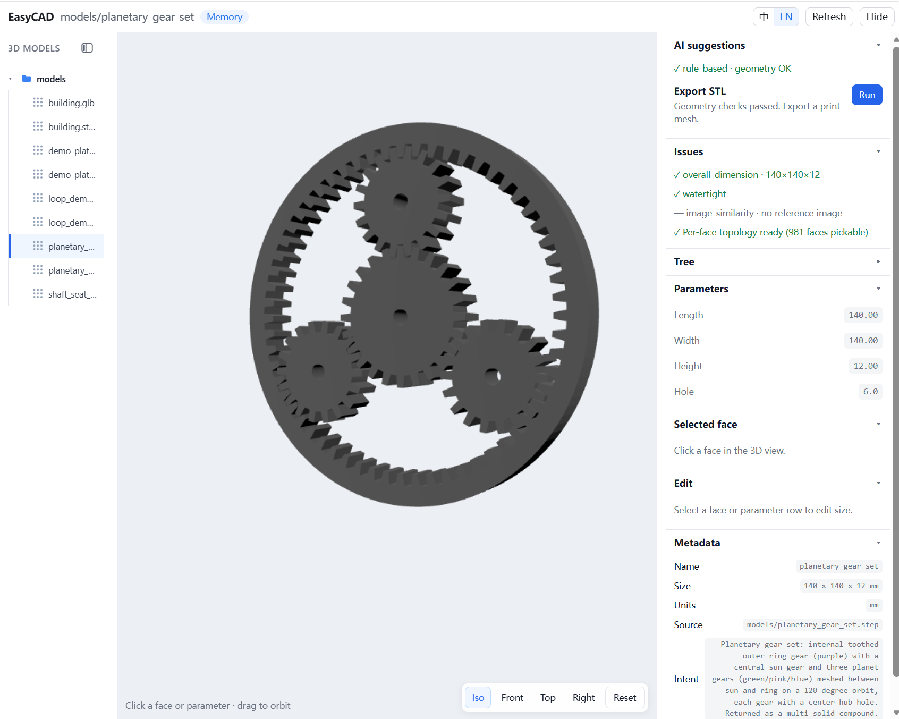

# SimpleCADforDSH

`SimpleCADforDSH` is an **out-of-tree plugin for [DeepSeek Harness](https://github.com/deepseek-ai/DeepSeek-Harness) (dsh)** that turns text prompts into real, parametric CAD. It uses the official dsh plugin contract (host tools + client slot + skill) and does not fork or patch the dsh source.

Ask for a part in plain language → the agent writes build123d Python, exports **STEP + GLB**, runs geometry **QA**, and opens a same-window CAD pane where you can tweak dimensions and re-generate.



## Features

- **Text → parametric CAD.** A `text-to-cad` skill drives brief → model → QA → export, locking `overall_size_mm` and `special_features` from the prompt.
- **CAD as code.** Every part is a `gen_step()` build123d script (`from build123d import *`), not a mesh, with overall dimensions in a `PARAMS` dict so it stays editable.
- **Built-in geometry QA.** `single_body`, `watertight`, and `overall_dimension` (0.2 mm tolerance) checks with pass/fail verdicts.
- **Same-window CAD pane.** A workbench opens on the right of the dsh UI — model tree, shaded 3D view, parameter sidebar, face inspector.
- **Parametric editing.** Change `length` / `width` / `height` / `hole_d` by clicking a face or via `simplecadfordsh_apply`; STEP + GLB regenerate automatically.
- **Export.** STEP, STL, GLB (3MF planned).
- **Advisory similarity.** CAD-vs-reference-image silhouette IoU plus rule-based AI suggestions from QA + similarity + brief intent.

## Tools

| Tool | What it does |
|---|---|
| `simplecadfordsh_brief` | Write an engineering IR + brief (envelope, features, `single_body`/`watertight`) |
| `simplecadfordsh_gen` | Write `gen_step()`, export STEP+GLB, return `facts` + `qa`, open the pane |
| `simplecadfordsh_inspect` | Re-measure geometry |
| `simplecadfordsh_qa` | Pass/fail checks only |
| `simplecadfordsh_measure` | Check named X/Y/Z overall sizes |
| `simplecadfordsh_export` | STL / GLB from an existing part |
| `simplecadfordsh_preview` | Show a part in the CAD pane |
| `simplecadfordsh_params` | Read editable fields (`length`, `width`, `height`, `hole_d`) |
| `simplecadfordsh_apply` | Apply param edits and regenerate STEP+GLB |
| `simplecadfordsh_snapshot` | Render ortho view PNGs (iso/front/right/top) |
| `simplecadfordsh_similarity` | CAD-vs-reference-image silhouette IoU (advisory) |
| `simplecadfordsh_advice` | Rule-based suggestions from QA + similarity + IR |

Reserved (schema only, not implemented): `simplecadfordsh_part` · `simplecadfordsh_assemble` · `simplecadfordsh_dfam`.

## How it works

```
prompt ─▶ text-to-cad skill
          ├─ simplecadfordsh_brief   (lock overall_size_mm / special_features)
          ├─ simplecadfordsh_gen     (build123d → STEP + GLB, facts + qa)
          ├─ [pane opens]    (QA issues, params, face inspector)
          └─ simplecadfordsh_export  (STL / GLB)
```

Every generated `gen_step()` declares overall dims in a top-level `PARAMS` dict and references `PARAMS[...]` in the body — that's what keeps parts editable in the pane and via `simplecadfordsh_apply`.

## Requirements

- Node.js 22
- A Python interpreter with `build123d` (and `numpy`; `PIL`/`trimesh` for image features)
- A dsh Web environment with your DeepSeek API key

## Install (native dsh)

The dsh package name is `simplecadfordsh`; make it resolvable and patch one row.

```bash
# 1. Make the package resolvable
#    $DSH_HOME/profiles/node_modules/simplecadfordsh  ->  <this-repo>/SimpleCADforDSH/dsh-plugin

# 2. Point the CAD interpreter at the active Conda environment
conda activate <conda-env-with-build123d>
# scripts/start-dsh-web.ps1 detects CONDA_PREFIX automatically.
# For native dsh without the script, set SIMPLECADFORDSH_PYTHON explicitly:
export SIMPLECADFORDSH_PYTHON=$(command -v python)
# PowerShell: $env:SIMPLECADFORDSH_PYTHON = (Get-Command python).Source

# 3. Patch one row in your dsh patch file
#    - insert: { id: simplecadfordsh, name: simplecadfordsh }
```

For a source checkout, run `pnpm install` and `pnpm run build` from the
`deepseek-harness` root first, then use `scripts/start-dsh-web.ps1` to create
the local link, generate the absolute-path patch, and run `pnpm dsh web`.

## License

MIT — see [LICENSE](LICENSE).
